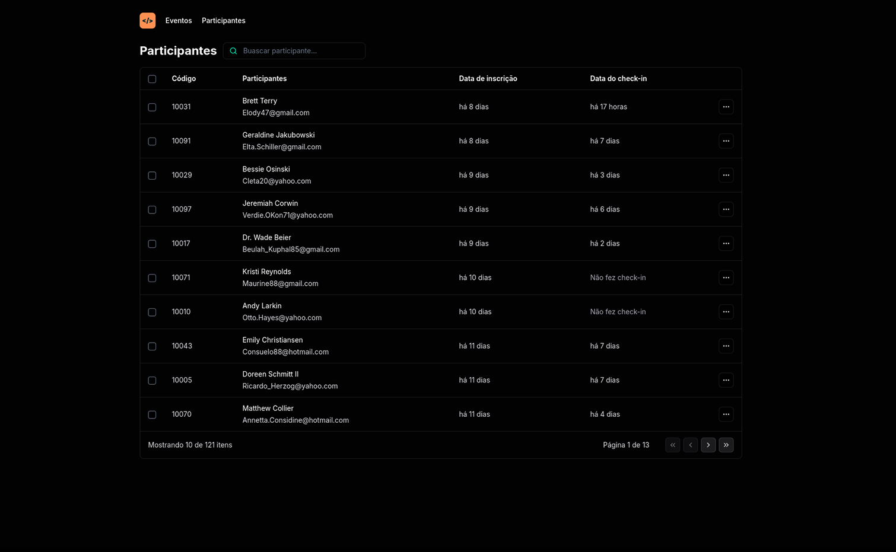

# NLW Unit React

Aplicação desenvolvida no NLW Unite da Rocketseat na trilha REACT.

## Projeto
Nesse projeto iremos desenvolver a versão simplificada de um sistema de check-in para eventos presenciais.

## 🚀 Tecnologias
Esse projeto foi desenvolvido com as seguintes tecnologias:
- React
- TypeScript
- Vite

 

  

    Para funcionar corretamente, subir o server primeiro

 

  

